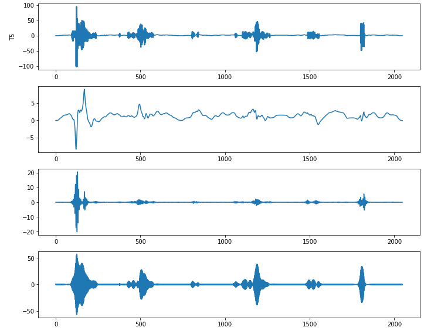
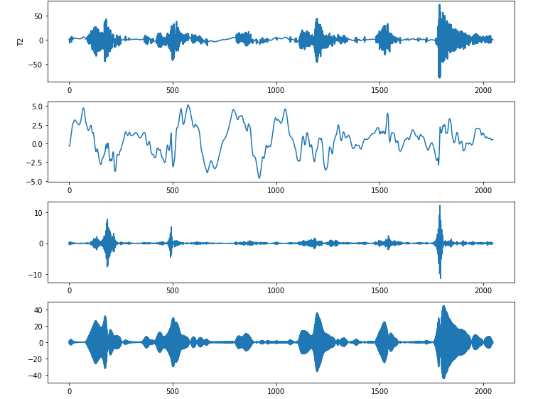
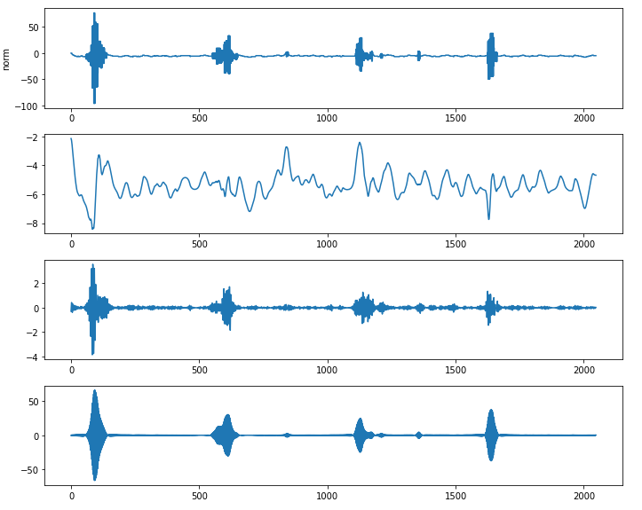
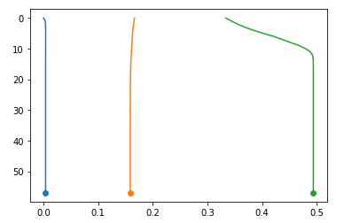
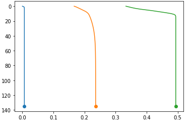
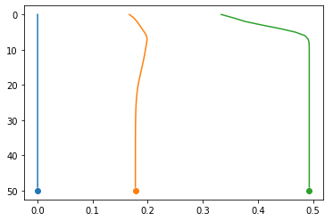
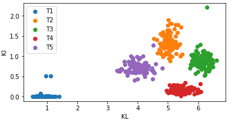

# CNN_AutoEncoder_clustering 
轴承信号分析与基于 VMD + 自编码器 的特征提取实验

本仓库用于对五类振动信号（`norm`, `T2`, `T3`, `T4`, `T5`）进行VMD（变分模态分解）、基于二值特征图的自编码器训练，以及基于瓶颈表示和奇异值分解(SVD)的散度（KL散度）分析，用以区分不同故障/工况信号。

## 目录结构

- `data_analysis.ipynb`：用于探索性分析、选择VMD的K值（IMF个数）并可视化IMF与中心频率迭代结果。
- `分类.ipynb`：主要实现流程，从VMD分解、构建二值图像输入、训练多个自编码器，到提取瓶颈编码并计算基于频次的KL散度与基于SVD特征的KL散度，最后绘图比较。

## 任务背景与目标

目标是通过对振动时序信号进行频带分解和特征学习，得到对不同故障（或工况）具有区分能力的特征表示。具体思路：

- 使用VMD将原始时序分解为若干IMF分量，尝试把各IMF的能量/频率分布分离开来（在本实验中常用K=3）。
- 将每个IMF或原始信号转为“二值图像”表示，作为自编码器的输入，以学习局部分布特征。
- 训练独立的自编码器（针对每个IMF及原始信号），提取瓶颈（neck）表示；通过统计瓶颈编码的频次分布并计算KL散度来衡量类间差异。
- 另采样SVD的奇异值作为替代/补充特征，同样用KL散度衡量差异性并与瓶颈图对比。

该流程侧重可解释性（频带分解 → 二值概率图 → 频次直方图 → KL散度）而非直接端到端分类。

## 数据说明

- 输入数据：5 列 CSV，每列为 2048 个时序点。

样本扩展与构建：

- 通过 `VMD_plot` 对单列信号进行 VMD 分解，得到 K 个 IMF（在Notebook中 K=3 常用）。
- `construct_data(imf, k, plot, dataset=100, sample=0)`：
  - 将IMF矩阵通过 `MinMaxScaler` 映射到 [-255, 255]，再线性映射为整数。
  - 对每一行（通道）添加微小随机扰动（最大 ±20，相当于约 8% 振幅噪声），然后把每个数值映射为二值行（长度 512），把数值对应的像素区块置为1，形成 512x2048 的二值“概率图”。
  - 生成 `dataset` 个样本（默认为100），最终形状 `(dataset, 512, 2048, 1)`。

此设计的直觉是：每个像素块表示原信号对应区域取 1 的“概率”或出现频率，便于用直方统计构建分布并计算KL散度。

## 方法细节

1) VMD（变分模态分解）

- 使用 `vmdpy.VMD` 将信号分解为若干内模态函数(IMF)与对应频率轨迹 `omega`。
- Notebook `data_analysis.ipynb` 中提供 `VMD_plot` 与 `watch` 函数用于可视化 IMF 与频率迭代，帮助选择合适的K（实验中发现 K=3 比较合适）。

2) 二值图像构建（`construct_data`）

- 先归一化到 ±255 整数区间，再把每个元素展开为行向量的区间置1，形成二值图像；此处每个数值会映射到连续的一段像素为 1，表示该位置的“激活”范围。

3) 自编码器结构（在 `分类.ipynb`）

- 典型结构（以 `input_image` 为例）：
  - Conv2D -> MaxPool2D -> Conv2D -> MaxPool2D -> Conv2D -> MaxPool2D 形成编码
  - 然后 Conv2D -> UpSampling2D -> Conv2D -> UpSampling2D -> Conv2D -> UpSampling2D -> Conv2D 输出重构
  - `encoded` 层名为 `op_encode`（neck），模型用 `mse` 训练。
- 为每个维度（IMF1, IMF2, IMF3, 原始）分别训练一个自编码器（`autoencoder0`..`3` 与对应 `encoder0`..`3`）。

4) 瓶颈编码与直方统计（`hist_scatter` / `KL_scatter`）

- 用 `encoder.predict()` 提取瓶颈输出（形状例如 `(100, 4, 32, 1)` 之类，取决于池化比例）。
- `hist_scatter`：对每个瓶颈样本做直方统计（bins 可配置），得到频次矩阵（用于近似分布）。
- `KL_scatter`：对两组直方频次计算对称或双向KL（代码中计算 `stats.entropy(P,Q)` 与 `stats.entropy(Q,P)`）。

5) SVD 特征（`klimf`）

- 对经过 `MinMaxScaler` 归一化的 IMF 矩阵做 SVD，取奇异值 `sigma` 作为每组样本的特征。为增加样本数，会在原 IMFs 上加入少量随机噪声生成 100 个样本并计算奇异值序列。

## 关键结果与结论

- 通过 `data_analysis.ipynb` 的可视化，K=3 是比较合适的选择（IMF 的中心频率分布较为均匀）。

  
  
  

  
  
  

- `分类.ipynb` 的实验显示：
  - 使用自编码器提取的瓶颈编码再做直方频次并计算 KL，可以较好地区分不同类别（不同 Tx）。
  - 基于 SVD 的奇异值（取 `sigma` 后计算 KL）也能区分类别，两类方法在散度图中有良好的分离度.
  

这些结果提示：

- 频带分解 + 局部二值“概率图” → 自编码器学习的瓶颈表示，是一个有可解释性的特征提取思路。
- SVD 奇异值作为信号能量/结构特征的补充，也能有效区分类间差异。

